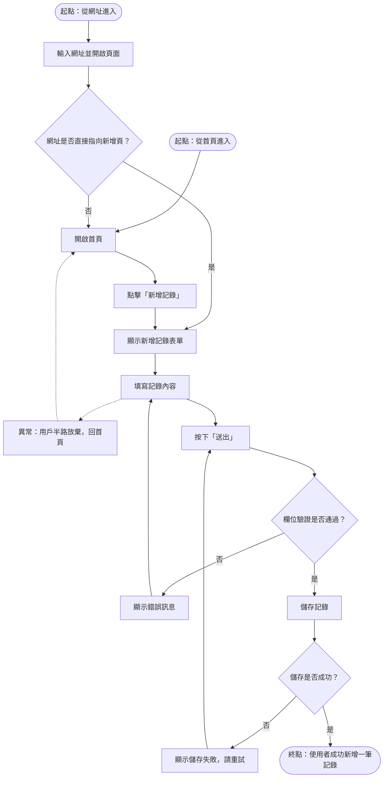

// 終點：使用者成功新增一筆記錄
// 以下為測試----------------

```mermaid
flowchart TD
    startHome([起點：從首頁進入]) --> home[開啟首頁]
    startUrl([起點：從網址進入]) --> openUrl[輸入網址並開啟頁面]
    home --> clickAdd[點擊「新增記錄」]
    openUrl --> isAddPage{網址是否直接指向新增頁？}
    isAddPage -- 是 --> form[顯示新增記錄表單]
    isAddPage -- 否 --> home
    clickAdd --> form
    form --> fillContent[填寫記錄內容]
    fillContent -.-> abandon[異常：用戶半路放棄，回首頁]
    abandon -.-> home
    fillContent --> submit[按下「送出」]
    submit --> validate{欄位驗證是否通過？}
    validate -- 否 --> showError[顯示錯誤訊息]
    showError --> fillContent
    validate -- 是 --> save[儲存記錄]
    save --> saveOk{儲存是否成功？}
    saveOk -- 否 --> saveFail[顯示儲存失敗，請重試]
    saveFail --> submit
    saveOk -- 是 --> endSuccess([終點：使用者成功新增一筆記錄])
```
// 以上為測試----------------------