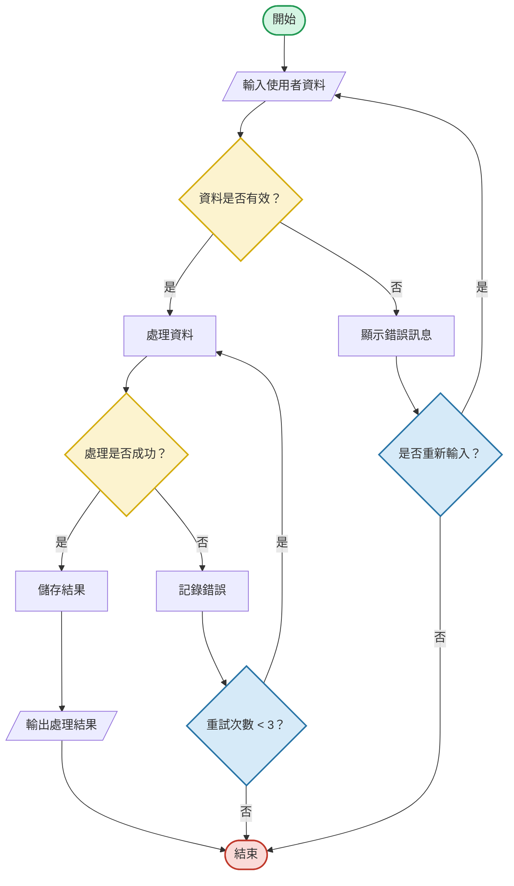

// 終點：使用者成功新增一筆記錄
// 以下為測試----------------

```mermaid
flowchart TD
    A([開始]) --> B[/輸入使用者資料/]
    B --> C{資料是否有效？}

    C -- 是 --> D[處理資料]
    C -- 否 --> E[顯示錯誤訊息]

    E --> F{是否重新輸入？}
    F -- 是 --> B
    F -- 否 --> G([結束])

    D --> H{處理是否成功？}
    H -- 是 --> I[儲存結果]
    H -- 否 --> J[記錄錯誤]

    J --> K{重試次數 < 3？}
    K -- 是 --> D
    K -- 否 --> G

    I --> L[/輸出處理結果/]
    L --> G

    style A fill:#d5f5e3,stroke:#229954,stroke-width:2px
    style G fill:#fadbd8,stroke:#c0392b,stroke-width:2px
    style C fill:#fcf3cf,stroke:#d4ac0d,stroke-width:2px
    style H fill:#fcf3cf,stroke:#d4ac0d,stroke-width:2px
    style F fill:#d6eaf8,stroke:#2874a6,stroke-width:2px
    style K fill:#d6eaf8,stroke:#2874a6,stroke-width:2px
```
// 以上為測試----------------------