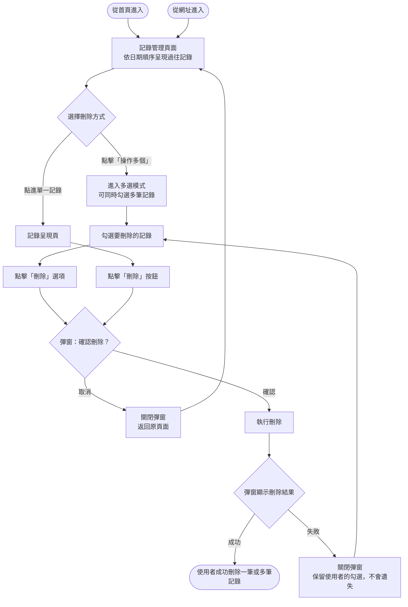

// 終點：使用者成功刪除一筆或多筆記錄

```mermaid
flowchart TD
    enterFromHome([從首頁進入]) --> recordManagePage
    enterFromUrl([從網址進入]) --> recordManagePage
    recordManagePage[記錄管理頁面<br/>依日期順序呈現過往記錄] --> chooseDeleteMethod{選擇刪除方式}

    chooseDeleteMethod -->|點擊「操作多個」| multiSelectMode[進入多選模式<br/>可同時勾選多筆記錄]
    multiSelectMode --> selectRecords[勾選要刪除的記錄]
    selectRecords --> clickBatchDelete[點擊「刪除」選項]

    chooseDeleteMethod -->|點進單一記錄| recordDetailPage[記錄呈現頁]
    recordDetailPage --> clickSingleDelete[點擊「刪除」按鈕]

    clickBatchDelete --> confirmDialog{彈窗：確認刪除？}
    clickSingleDelete --> confirmDialog

    confirmDialog -->|取消| closeConfirmDialog[關閉彈窗<br/>返回原頁面]
    closeConfirmDialog --> recordManagePage
    confirmDialog -->|確認| executeDelete[執行刪除]
    executeDelete --> resultDialog{彈窗顯示刪除結果}
    resultDialog -->|成功| deleteSuccess([使用者成功刪除一筆或多筆記錄])
    resultDialog -->|失敗| keepSelection[關閉彈窗<br/>保留使用者的勾選，不會遺失]
    keepSelection --> selectRecords
```