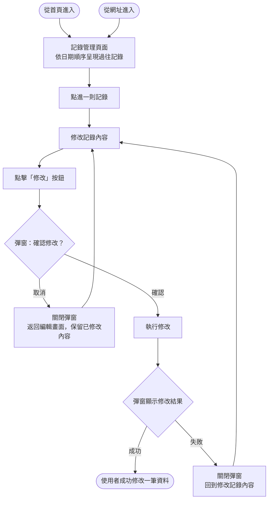

// 終點：使用者成功修改一筆資料

```mermaid
flowchart TD
    enterFromHome([從首頁進入]) --> recordManagePage
    enterFromUrl([從網址進入]) --> recordManagePage
    recordManagePage[記錄管理頁面<br/>依日期順序呈現過往記錄] --> openRecord[點進一則記錄]
    openRecord --> editContent[修改記錄內容]
    editContent --> clickModify[點擊「修改」按鈕]
    clickModify --> confirmDialog{彈窗：確認修改？}

    confirmDialog --> |取消| closeConfirmDialog[關閉彈窗<br/>返回編輯畫面，保留已修改內容]
    closeConfirmDialog --> editContent
    confirmDialog --> |確認| executeModify[執行修改]
    executeModify --> resultDialog{彈窗顯示修改結果}
    resultDialog --> |成功| modifySuccess([使用者成功修改一筆資料])
    resultDialog --> |失敗| closeResultDialog[關閉彈窗<br/>回到修改記錄內容]
    closeResultDialog --> editContent
```