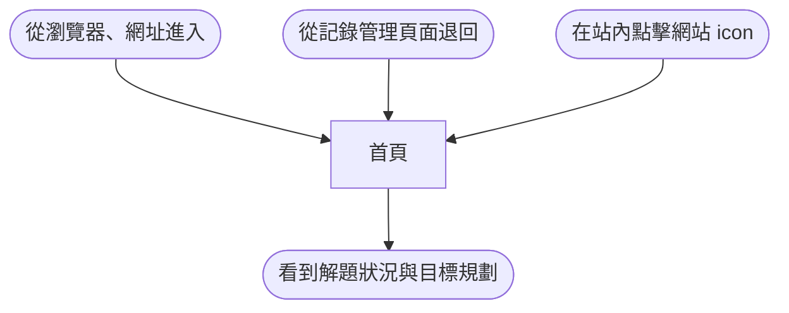

// 終點：看到解題狀況與目標規劃
// 起點：從瀏覽器、網址進入
// 備註：這是首頁

```mermaid
flowchart TD
    enterFromUrl([從瀏覽器、網址進入]) --> homePage[首頁]
    backFromRecordPage([從記錄管理頁面退回]) --> homePage
    clickSiteIcon([在站內點擊網站 icon]) --> homePage
    homePage --> seeStatus([看到解題狀況與目標規劃])
```